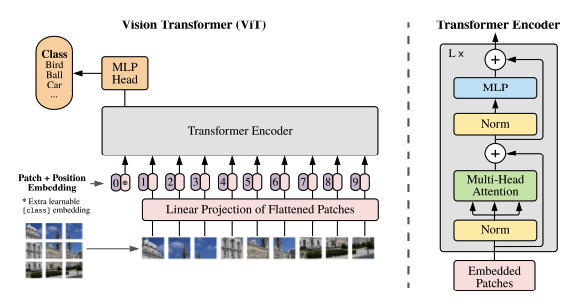

<H1>CS698 Machine Listening 🔈👂</H1>
<H2>Speaker Recognition ViT</H2>

  Ethan Oh :: <a href="mailto:eo238@njit.edu">eo238@njit.edu</a>

<u><b>Objective</b></u>
 Since the publishing of Google's seminal paper <a href="https://arxiv.org/abs/1706.03762">
Attention is All You Need</a>, the Transformer model has transformed the machine learning
field. Google submitted a paper on adapting the Transformer to machine vision with the 
Vision Transformer (ViT): <a href="https://arxiv.org/abs/2010.11929"> An Image is Worth 16x16
Words</a>. The paper outlines how a Transformer can be adapted to achieve SoTA level in image
recognition and in some cases, outperform CNN models as ResNet.

In machine listening, audio waveforms are commonly converted to spectrograms for machine
learning tasks. Spectrograms are visual representations of an audio clip and therefore, 
machine vision tools are used for feature extraction and learning. The use of CNNs as a 
standalone model or as part of a hybrid model is the norm.

The goal of this project was to apply the Transformer to a machine listening task, 
specifically, Automated Speaker Recognition (ASR). Several Transformer-based models were 
considered, including <a href="https://arxiv.org/abs/2203.15249">MFA Conformer</a> and 
<a href="https://arxiv.org/abs/1912.12180">Axial Attention</a>. However, I have settled 
on ViT and this repo is home to the implementation. Both .py and .ipnb versions have been 
made available.

<u><b>Model</b></u>
 ViT tackles image-based tasks by employing patching, where an input image is subdivided
into patches and treated as a token in an NLP task. The patches are then processed by a
Multi-head Attention block to learn the relationships between each patch.
 
 Because audio is a time-based data, spectrograms need to be evaluated along both the 
x and y axes. Consequently, the idea behind using ViT for ASR is to take advantage of the 
patching concept but instead of subdividing into squares,the spectrogram was patched into 
vertical strips of image height x 1 dimension. These strips were then embedded and 
processed by the attention block.

<u><b>Dataset</b></u>
 <a href="https://www.robots.ox.ac.uk/~vgg/data/voxceleb/">VoxCeleb1</a>
 Utterances of celebrities have been aggregated from YouTube to create this dataset and 
is used frequently for training speech recognition models. From this dataset, 113,985 clips 
of 932 classes were used to train this project's ViT model.
  The dataset wav files were converted to Mel-spectrograms using 
<a href="https://github.com/librosa/librosa">Librosa</a> and scaled to 256x256 PNG files.

<u><b>Paper</b></u>
 <i><b>An Image is Worth 16x16 Words: Transformers for Image Recognition at Scale</b></i>
 Alexey Dosovitskiy, Lucas Beyer, Alexander Kolesnikov, Dirk Weissenborn, Xiaohua Zhai, Thomas Unterthiner, Mostafa Dehghani, Matthias Minderer, Georg Heigold, Sylvain Gelly, Jakob Uszkoreit, Neil Houlsby
 Google Inc.

